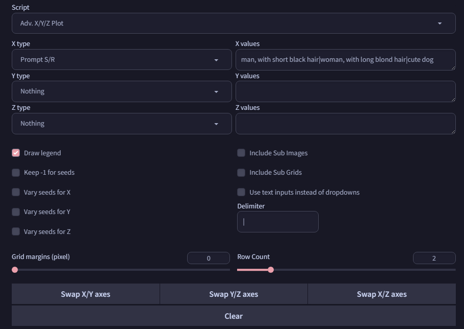

# SD Webui Advanced X/Y/Z
This is an Extension for the [Automatic1111 Webui](https://github.com/AUTOMATIC1111/stable-diffusion-webui), which adds an improved version of the **X/Y/Z Plot** script.

> Compatible with [Forge](https://github.com/lllyasviel/stable-diffusion-webui-forge)~

## What's New
This script works just like the built-in one, but with the addition of the following new features:

#### Delimiter
Tried to use `Prompt S/R`, but your target string contains comma? Now you can choose another `Delimiter`, in order to replace strings that contain commas!

#### Row Count
Tried to compare something, but the grid is too wide? Now you can break up the grid into multiple rows!

> **Note:** Only works for `X axis` currently

#### Clear Button
Quickly clears out the fields with just one click!

#### Display Configs
After the Webui is launched for the first time with this Extension installed, it will generate a `config.json` file in the folder, with all currently available `Types` listed. You can edit this file, and move labels to the **"hide"** array to stop them from showing up in the dropdown. Require closing and restarting the Webui after you edit the file.

### Showcase

   
<code>New UI</code> <code>Results</code>

